TwitterDev Collections Chrome Extension v0.1
=====

Chrome extension to curate tweets from twitter.com into user-managed collections. These tweets are then easily embedded into a blog post/CMS system with a Twitter button in your Chrome browser. (Embedded tweets use the Twitter oEmbed API.)

This tool is made open source by the @TwitterDev team as a reference for how to integrate Twitter + your tools + Chrome browser for an optimal user experience. Other potential uses for this open source extension might include:

- Tweet collection and embedding into custom CMS systems
- Integrating tweet discovery and curation tools for reporters or storytellers
- Tweet curation for photo walls or galleries

This extension uses the Twitter Collections API as the back-end storage to save and manage tweets. Tweets managed by other Collections-compatible Twitter clients (including TweetDeck, Curator and twitter.com) can be used to collect and manage tweets for embedding. For access to the Twitter Collections API, please read the Development section below for instructions on how to get access.

Please note that this sample uses Twitter Collections, which requires additional app permissions. If you choose to use this or a derivation for production purposes, contact Twitter directly to enable your app with the Collections Beta permissions. More info about collections and access can be found here: [https://dev.twitter.com/rest/collections/about](https://dev.twitter.com/rest/collections/about) 

Usage
--------

### Curating Tweets

Users can curate tweet into collections directly from twitter.com. This extension extends the Twitter.com user interface to add collections easily from the timeline.

##### Step 1: Click on the "+" icon beneath the tweet

##### Step 2: Choose Collection (or create new one) and save tweet

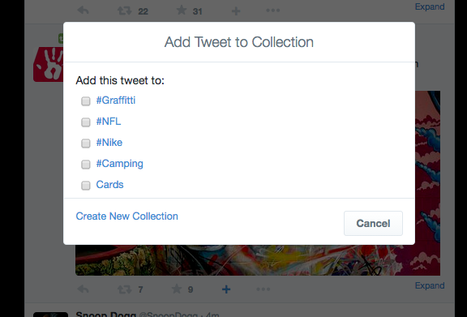

### Embedding Tweets

Users can embed one or more tweets via the Chrome Extension button near the browser's location bar.

##### Step 1: Click on browser button to see Collections/Tweets

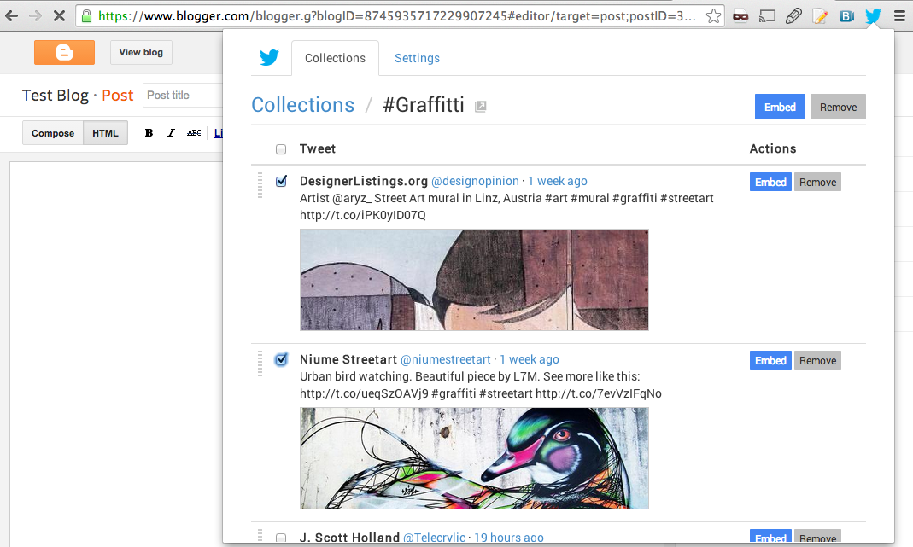

##### Step 2: Select (Multiple) Tweets to embed

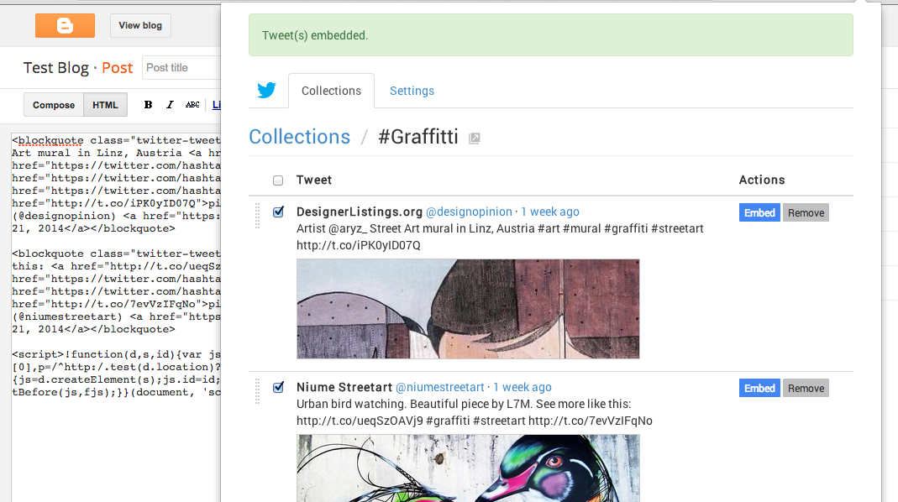

### Settings

Embedded Tweets are customizable, allowing for media, threaded conversations, light/dark templates and custom templates.

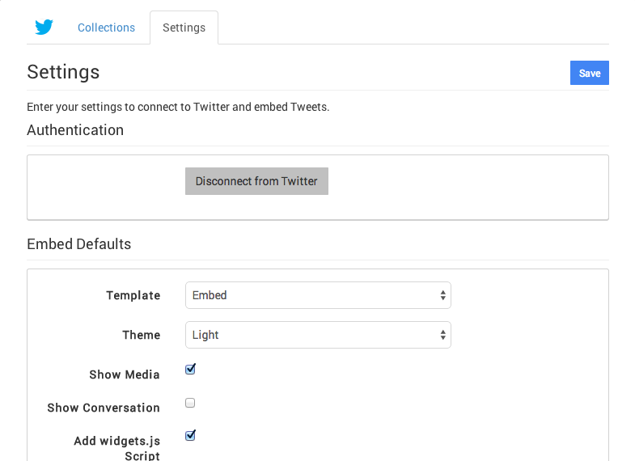

Installation
--------

To install this Chrome Extension, follow the below instructions.

##### Step 1: Open Chrome and go to the Extensions Page.

To open settings, either use the tool bar under 'Chrome->Preferences', or click on the settings button to the far right of the browser location. After you're in Settings, click on the 'Extensions' link to the left.

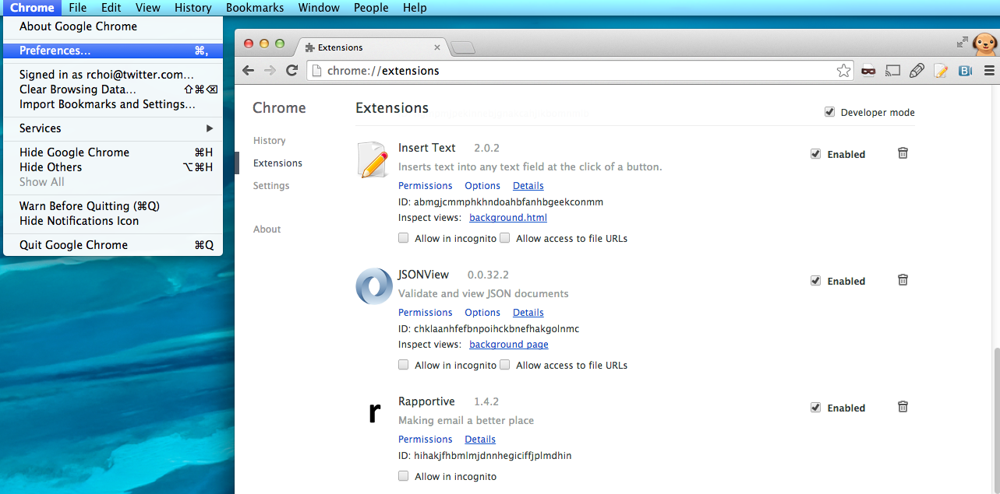

##### Step 2: Drag and drop the pubtools.crx file into the Extensions Page.

You will see a drop target appear that says "Drop to install". 

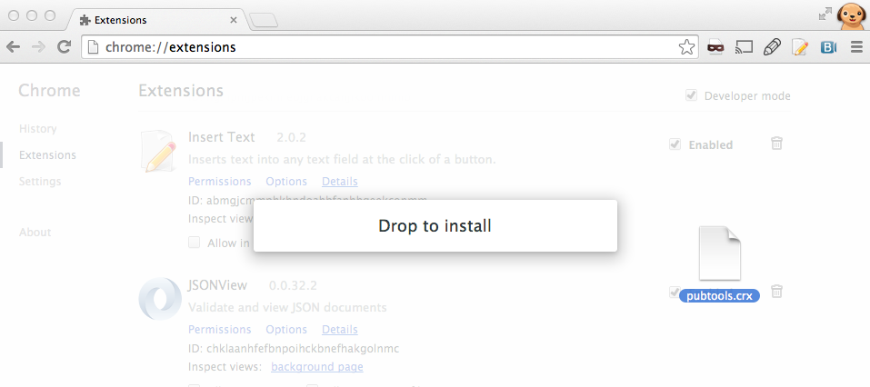

After you drop, click on the "Add" button in the prompt.

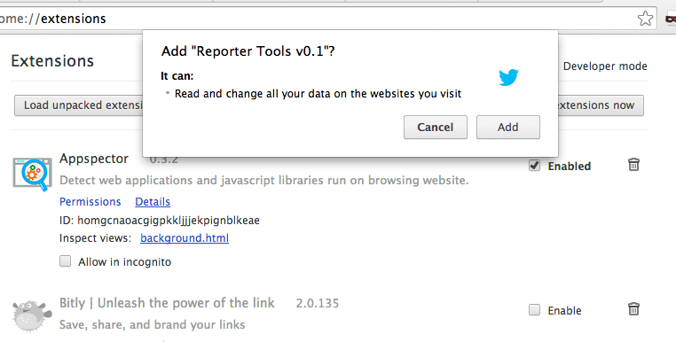

After installation, a browser window will also pop-up with the extension's settings page. If it does not, follow Step 3 below to open the extension's settings window manually.

##### Step 3: Find "TwitterDev Collections Extension v0.0.2" in the Extensions list and click  "Options".

This will take you to the Extension's own settings page. (Different from your browser's settings.)

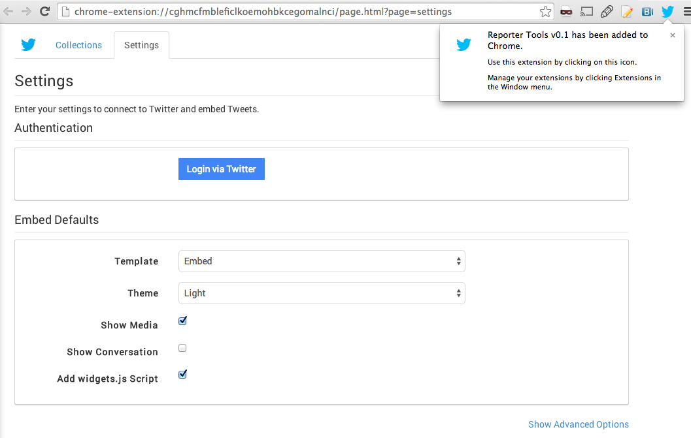

##### Step 4: Click on the "Login via Twitter" button.

This begins the Twitter authentication process.

##### Step 5: In the new window, click on the "Authorize app" button.

A new window will open and prompt you to Authorize (and link) your Twitter account.

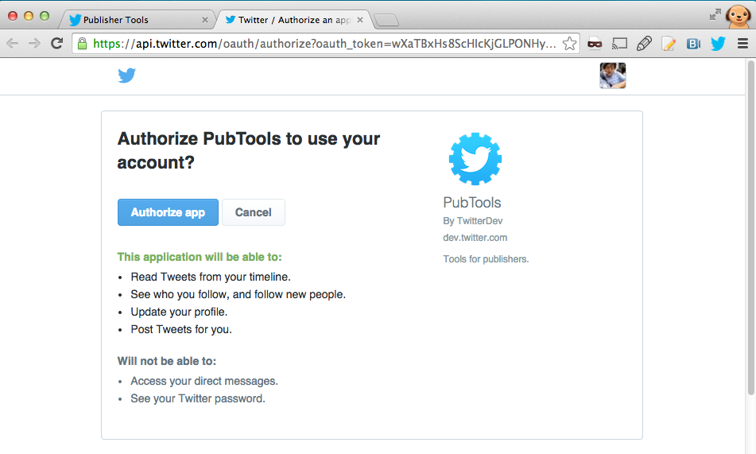

##### Step 6: Copy the PIN you see.

This pin confirms your identity with the application

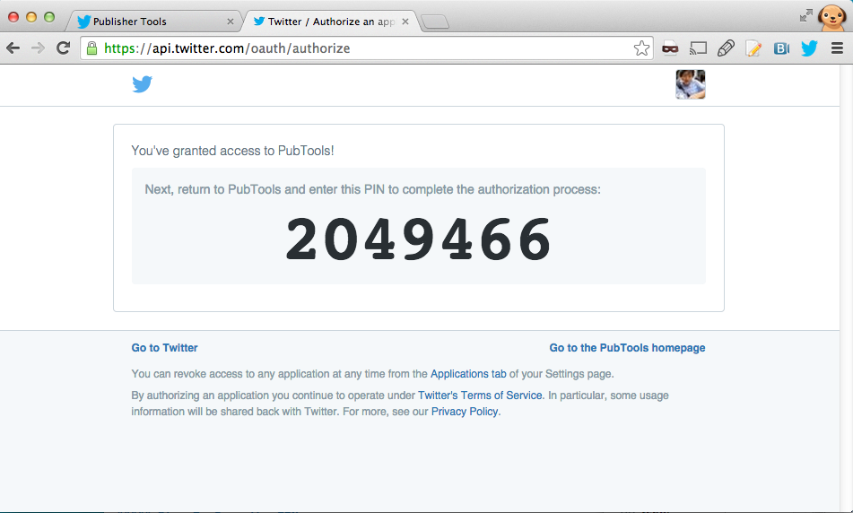

##### Step 7: Go to the original tab and submit the PIN.

This completes the authentication process.

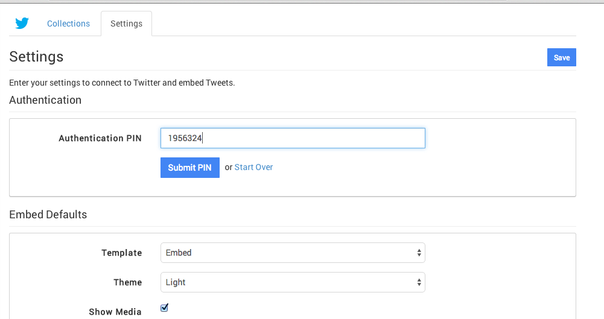

You will see a confirmation message when complete.

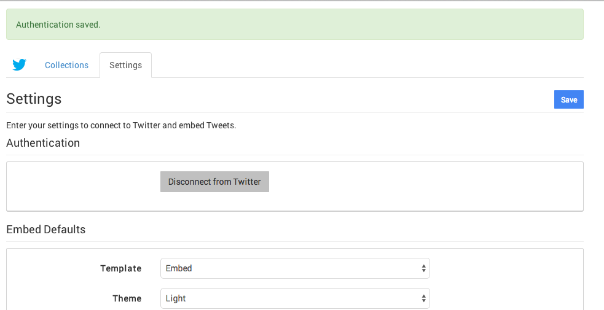

If you experience an error, please try the login process again. If you continue to have problems, please contact the below support e-mail below.

Dependencies
--------

The following libraries are used in this extension. All libraries are included
under the js/lib directory to make this source self-contained. 

- Bootstrap (3.0.3): http://getbootstrap.com/ 
- JQuery (1.10.1): http://jquery.com/
- JQuery UI (1.10.4): http://jqueryui.com/
- Mustache.js: https://github.com/janl/mustache.js 
- Async: https://github.com/caolan/async
- Codebird (Modified for Twitter Collections): https://github.com/jublonet/codebird-js

Development
--------

This sample uses Twitter Collections, which requires additional app permissions. This code ships with default auth tokens, so that developers can being developing and testing immediately. 

If you choose to use this or a derivation for production purposes, contact Twitter directly to enable your app with the Collections Beta permissions. More info about collections and access can be found here: [https://dev.twitter.com/rest/collections/about](https://dev.twitter.com/rest/collections/about) 
 
Lastly, the common.js file has an ONLINE flag that can be disabled for quick development and  testing without a network connection. Consider using this flag when making iterative UI changes. 

Todo
--------

Upcoming features:

- Implement Custom Macro Template

Support
--------

This library is open source, and as such carries no warranties or commercial support. For 
bugs and other issues, please contact rchoi@twitter.com.

License
--------

Please read the LICENSE file in the root path.

